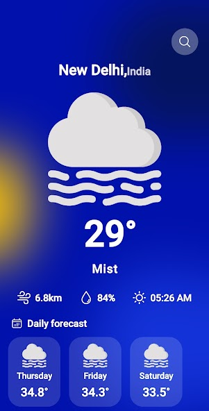

# weatherwhiz 

wallabag is a weather app for your choice.  

Your go-to weather app for real-time forecasts, interactive maps, and personalized alerts. Stay informed and plan your day with accurate weather information at your fingertips.

  

        

## About

WeatherWhiz is a smart and intuitive weather application designed to provide users with comprehensive and accurate weather information. With WeatherWhiz, users can stay informed about the latest weather conditions, forecasts, and alerts in their area.
WeatherWhiz stands out by offering a user-friendly interface and a range of powerful features.
It provides real-time updates on temperature, humidity, wind speed, and atmospheric pressure. Users can also access detailed hourly and daily forecasts, allowing them to plan their activities accordingly.
One of the key features of WeatherWhiz is its ability to provide localized weather information. By utilizing advanced location tracking, the app delivers hyper-local forecasts, ensuring that users receive accurate weather data for their precise location.
With its intuitive design and robust features, WeatherWhiz aims to be the go-to weather application for users who seek reliable and up-to-date weather information to make informed decisions about their daily activities and plans.
## Features

The  app lets you:

1. Daily weather forecast
2. In advance 3 days weather forecast
3. Realtime weather

## Screenshots

## Contributing

weatherwhiz  is a free and open source project. Any contributions are welcome. Here are a few ways you can help:

- [Report bugs and make suggestions.](https://github.com/arunavabasu-03/weatherwhiz/issues)

## License

This application is released under GNU GPLv3 (see [LICENSE](LICENSE)).
Some of the used libraries are released under different licenses.
